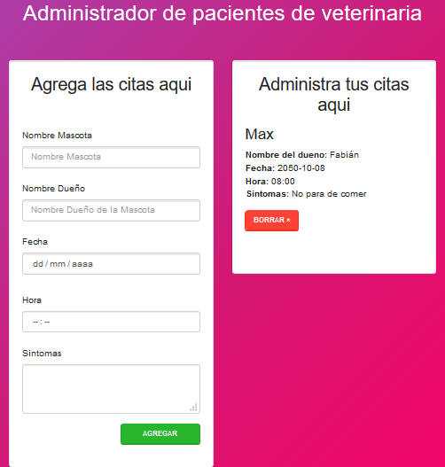

# Gestor de citas

Gestor de citas para veterinaria hecha con ReactJS

[Ver la aplicación](https://esdraspavon.github.io/citas/)

## ¿Cómo funciona?

Requiere Node.JS 10

- `npm install` para instalar las dependencias.
- `npm run start` para el entorno de desarrollo.
- `npm run build` para el entorno de producción.

## Licencia

MIT
